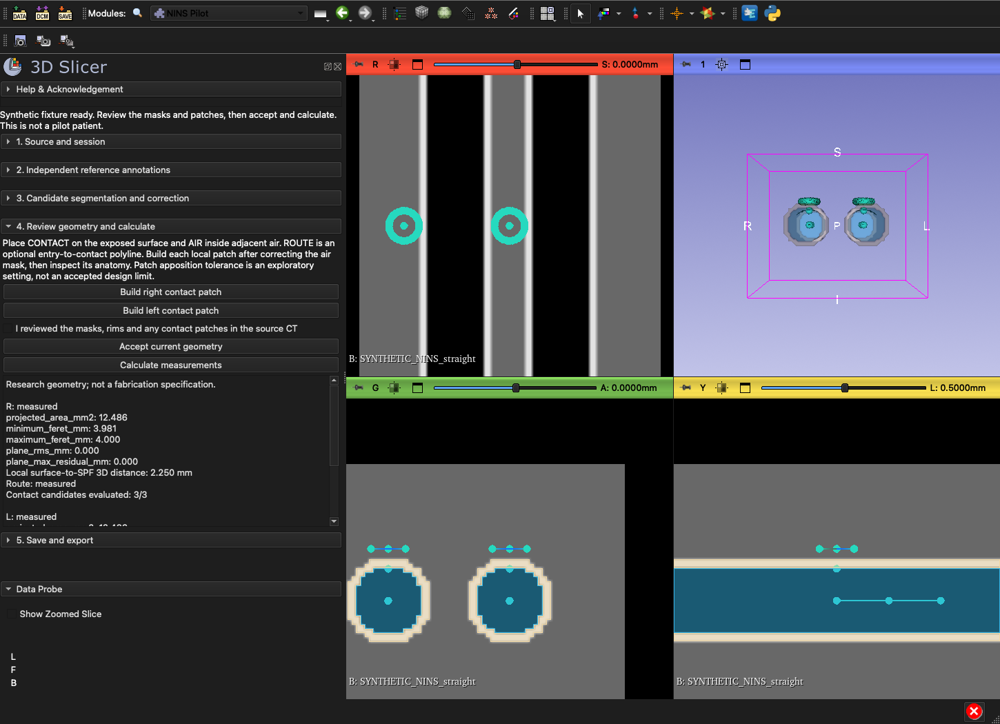

# NINS Pilot panel

Version 0.4.0 is the setup-case implementation. It connects source review, reference annotation, candidate masks, editing, geometry, and export in one Slicer panel. The synthetic demonstration exercises software behavior; it is not one of the three clinician-reviewed setup cases.



## Install and start

1. Clone or download the whole repository. Keep its `NINSPilot` and `scripts` folders together.
2. In Slicer, open **Settings > Modules > Additional module paths** and add the repository's `NINSPilot` directory. Restart Slicer.
3. Select **Research > NINS Pilot**. Choose **Load synthetic demonstration** first. Review the masks and orange patches, check the anatomical-review box, choose **Accept current geometry**, then **Calculate measurements** and **Export**.

For a temporary developer load, run this in Slicer's Python console:

```python
import slicer, qt
factory = slicer.app.moduleManager().factoryManager()
factory.registerModule(qt.QFileInfo('/absolute/path/to/nins-stent-constraints/NINSPilot/NINSPilot.py'))
factory.loadModules(['NINSPilot'])
slicer.util.selectModule('NINSPilot')
```

The demonstration creates only synthetic anatomy. Its auto-filled checks and references are explicitly labeled synthetic. Real sessions start with empty annotations and unchecked source criteria.

## Run a setup case

1. Load a verified original CT in Slicer. Select it in the panel, enter coded case/reviewer IDs, choose **Setup**, and choose a secure study directory outside the repository. **Start session**. The source is associated by MRML node reference, voxel fingerprint, and geometry; names are not used to select it.
2. Verify the source checkboxes. Primary setup cases require native submillimeter sampling, noncontrast CT and verified HU units. Use **Challenge** for technical exploration outside that sampling cohort; never relabel resampled data as native. Source identity and HU claims are clinician assertions, not inferred from histograms.
3. Mark each side assessable or record an unassessable reason. Choose an electrode concept if the team has decided one; otherwise keep **Not specified**. Concept selection does not authorize or model transforaminal insertion.
4. On each assessable side, place one **SPF** reference and an ordered **RIM** closed curve. Rims are linear polygons through the control points. Preserve the reference before displaying candidate segmentation. A second rater uses a separate session without viewing the first reference or algorithm output.
5. Resize the ROI to the relevant nasal region with adequate margin around the target. Generate candidates using one method. The initial masks are saved before correction. For a method comparison, start another session with the same coded patient, source and comparable ROI.
6. Correct air/bone masks with the embedded Segment Editor. The air threshold includes any matching air in the ROI, including sinus or external air. Review its nasal extent and exclude leakage. The panel does not identify contiguous named bones or the SPF automatically. Smoothing alters measurements; if used, record it in the setup worksheet and examine its effect near thin boundaries.
7. Optionally place **CONTACT** on the exposed air-tissue surface, **AIR** within adjacent air, and a **ROUTE** from entry toward the contact region. Build a local patch on that side. Inspect the patch in slices and 3D. Its spherical crop and connected-component selection can include the wrong wall or miss folds. Regenerate after changing the air mask or contact location. Patches too close to the ROI boundary are refused to avoid measuring a cut plane.
8. Confirm anatomical review and **Accept current geometry**. Calculate. Changed masks, points, settings or surfaces require acceptance again. Changed source voxels or source geometry require a new session.
9. Export into a new run directory. Save progress when leaving the task. Resume by selecting the same original source and its checkpoint `session.json`; the source must match exactly. Re-review after resuming.

The reference and correction timers measure time while explicitly running. Pause them for interruptions. They do not infer activity from mouse movement. They exclude inference time because correction timing starts after proposal generation.

## Segmentation methods

| Method | Initial result | Status |
|---|---|---|
| HU threshold | Air from -1024 HU to the selected upper threshold; bone above the selected lower threshold, within the ROI | Working default; tested with synthetic volumes |
| Manual baseline | Empty air and bone segments | Working comparator; requires tracing |
| TotalSegmentator | `head_glands_cavities` nasal-cavity masks restrict the threshold air proposal; bone stays threshold based | Optional adapter; requires an installed extension and dependencies; real model inference requires separate validation |

TotalSegmentator runs locally but may download model weights on first use. The panel does not install the extension. The original broad model segmentation is retained alongside the initial air/bone proposals. Record the model package version in the run manifest. Compare its correction burden on the setup cases before selecting it for evaluation.

## What the numbers mean

| Output | Definition and limitation |
|---|---|
| Aperture area | Area of the ordered rim polygon projected onto its least-squares plane. Self-intersecting or collinear rims are refused. |
| Minimum Feret | Minimum distance between parallel supporting lines of the projected rim's convex hull. |
| Maximum Feret | Maximum pairwise distance on that convex hull. |
| Plane residuals | RMS and maximum distance of rim points from the fitted plane. Reported alongside dimensions; no arbitrary pass/fail cutoff. |
| Local surface-to-SPF distance | Shortest 3D distance from the supplied SPF reference to the reviewed local patch. It is not SPG distance or stimulation reach. |
| Contact candidates | Existing contact engine evaluates the selected footprint at 0, 45 and 90 degrees. Reports apposition, gaps, relief and curvature. Missing or multilayer surface samples remain rejected. |
| Route profile | Minimum sampled distance from a supplied polyline to the reviewed air boundary, with samples no farther apart than half the smallest voxel spacing. Outside-lumen samples cause refusal. This is a local geometric radius, not whole-device insertion clearance. |

The initial 0.25 mm gap tolerance is an exploratory UI setting. It is recorded explicitly and is not an accepted engineering or clinical tolerance. Width and length are candidate face dimensions, not a stent prescription. No mechanical deformation, retention, pressure or electrical model is included.

The panel uses the reviewed rim directly; it does not claim independent SPF localization accuracy. Contact output remains based on an exposed surface, not segmentation of full mucosal thickness. The legacy stent engine remains separately runnable and unchanged.

## Saved outputs

Each session retains the pre-segmentation reference, uncorrected prediction, method settings, and successive checkpoints. Each exported run contains a JSON report, normalized measurement CSV, contact reports/meshes when available, and per-side orthogonal slice screenshots with a capture-status file. The source CT is not duplicated by checkpoints; keep the original series in the secure study store.

Checkpoints and exports contain case-derived geometry and potentially identifying facial anatomy in screenshots. Keep the entire study directory outside the public repository. Only generated synthetic fixtures are used in repository tests.

## Three setup cases and the evaluation handoff

Use [SETUP_CASES.csv](../templates/setup_cases.csv) in the secure study directory. It is blank and does not enroll patients. Capture source eligibility, independent reference review, correction minutes, anatomical failures and agreement for the same measurement definitions. Both sides remain linked to their patient.

The panel currently offers setup, challenge and synthetic cohorts. Evaluation enrollment is intentionally deferred until the three setup cases establish the selected method, measurement definitions, engineering tolerances and reviewer procedure. Freeze the code revision, dependency/model versions and configuration before running the nine evaluation cases. The existing [team workflow](TEAM_WORKFLOW.md) remains the study framework.

## Validation

Local checks on October 4, 2026 passed: 49 Slicer integration assertions; 9 numerical pilot tests; 8 intake/review tests; 12 contact tests; and 47 existing calibration checks. The GUI integration used Slicer 5.13.0-2026-08-10 with NumPy 2.4.6, SciPy 1.17.1 and VTK 9.6.2. The standalone checks also passed with the older PythonSlicer dependency versions pinned in `requirements-test.txt`. No clinical case acceptance or pretrained-model inference is claimed by these checks.

Ordinary Python with `requirements-test.txt` can run the numerical tests, legacy calibration checks and intake/contact tests. The Slicer integration script creates straight, narrow and artifact fixtures, exercises review gating, segmentation, one-sided review, contact measurements, checkpoint resume, source-change detection and export, then loads the actual panel and runs its demonstration.

```bash
python -m unittest discover -s tests -p 'test_*.py' -v
python scripts/tests/test_pilot_intake.py
python scripts/tests/test_contact_geometry.py
python test_calibration.py
```

Run the integration test in a separate Slicer process, never in a patient scene:

```bash
/path/to/Slicer --no-splash --ignore-slicerrc --python-script /path/to/repository/tests/slicer_smoke.py
```

GitHub Actions runs numerical and data-integrity checks. Slicer UI integration is a separate local check. Synthetic passes do not establish clinical performance or complete the three setup cases.

Implementation references: [Slicer segmentation scripting](https://slicer.readthedocs.io/en/latest/developer_guide/script_repository/segmentations.html), [Markups](https://slicer.readthedocs.io/en/latest/developer_guide/script_repository/markups.html), [TotalSegmentator Slicer logic](https://github.com/lassoan/SlicerTotalSegmentator).
